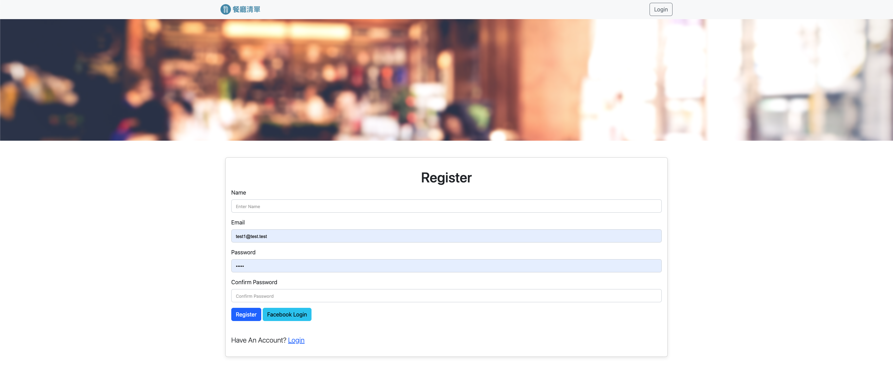
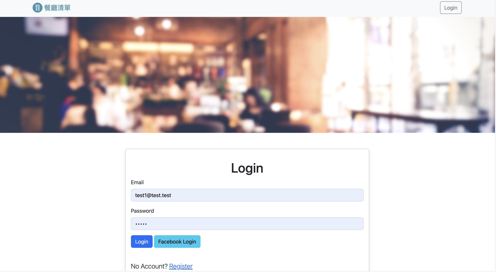
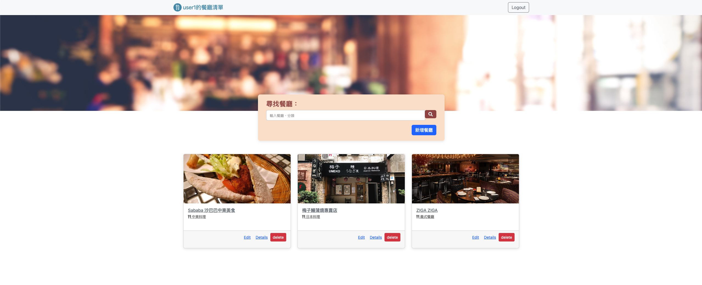

# Restaurant List

打造餐廳清單

## Features

-   顯示全部餐廳
-   顯示個別餐聽
-   透過餐廳名稱、餐廳類別，搜尋特定餐廳
-   新增餐廳資料
-   編輯餐廳資料
-   刪除餐廳資料
-   使用者註冊
-   使用者登入

## Register



## Login



## Restaurant_list



## Get started

### 1. Clone 專案

開啟終端機(Terminal) cd 到存放專案本機位置並執行:

```
git clone https://github.com/hl94vul3h6/A1_restaurant_list_final.git
```

### 2. 進入專案資料夾

`cd A1_restaurant_list_final`

### 3. 安裝所需npm套件

`npm install`

### 4. 匯入種子資料

`npm run seed`

如顯示 mongodb connected! 及 done 代表已成功匯入種子資料，按下ctrl+c退回輸入狀態

### 5. 啟動

`npm run dev`

### 6. 啟動瀏覽器並連線至以下網址

`http://localhost:3000`

## 使用套件

-   VScode - 開發環境
-   Express.js-4.16.4 - 應用程式架構
-   Express-handlebars-3.0.0 - 模板引擎
-   Mongoose-5.9.7
-   Body-Parser-1.20.1
-   nodemon - 自動化 reload
-   bootstrap5 - 優化界面
-   passport-facebook-3.0.0
-   passport-local-1.0.0
-   passport-0.4.1
-   connect-flash-0.1.1
-   bcryptjs-2.4.3
-   dotenv-8.2.0
-   express-session-1.17.1
-   method-override-3.0.0
 

## 使用套件

MongoDB

## 作者

Watson Huang